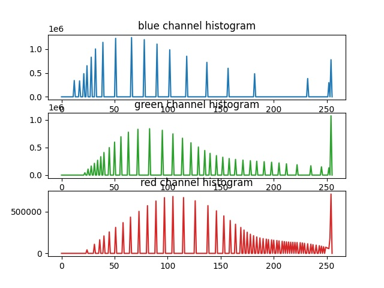
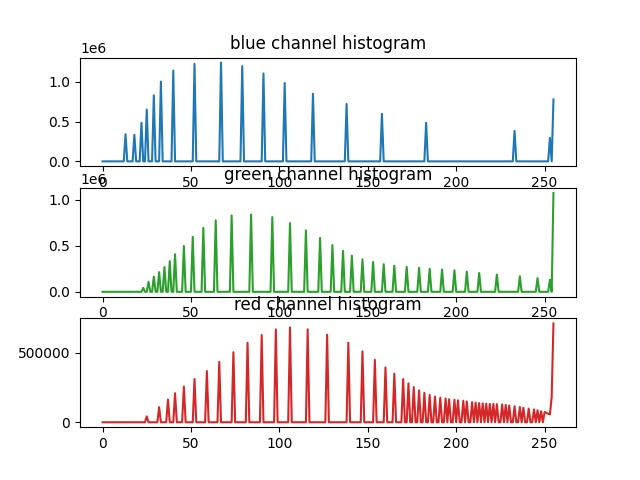

# Histogram-Specification

In a number of scientific or artistic applications we need to change the color histogram of the reference image in such a way that Its histogram should look like the destination image. This may make the details of the dark parts of an image clearer or create artistically beautiful visual effects; In this project, we implemented this method using Python.

# Given Images

  
  

# Results

  
  
  
  

